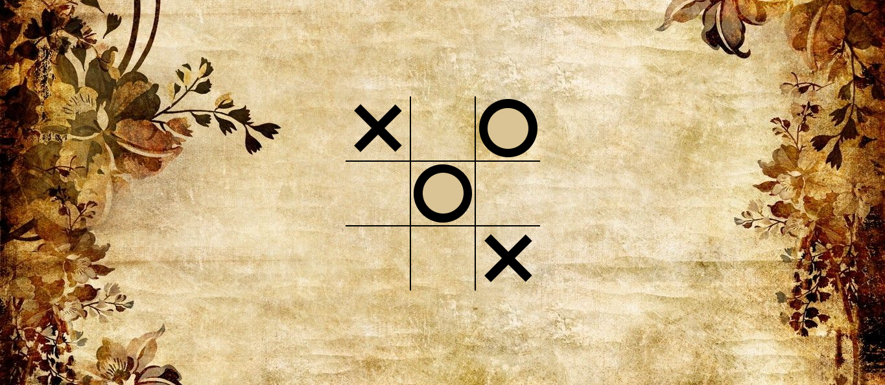
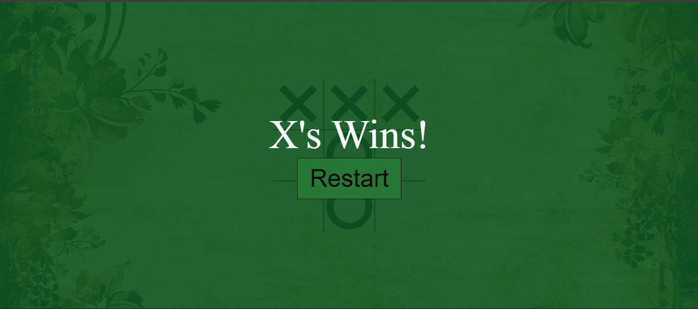
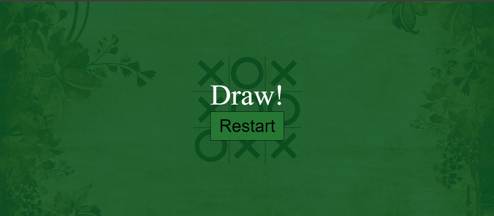

# Tic-Tac-Toe-Game
# Two Player Game
"This project is a simple implementation of the classic Tic-tac-toe game using HTML, CSS, and JavaScript. The game provides a two-player experience, where players take turns to place their symbol (X or O) on a 3x3 grid. The objective is to form a line of three consecutive symbols either horizontally, vertically, or diagonally."

<h1 align="center">
  <a href="https://tic-tac-toe-arnnab.netlify.app">👉Live Demo👍</a>
</h1>

## Screenshots

*Enjoy playing the Game! If you have any feedback or suggestions, feel free to reach out to me.*
